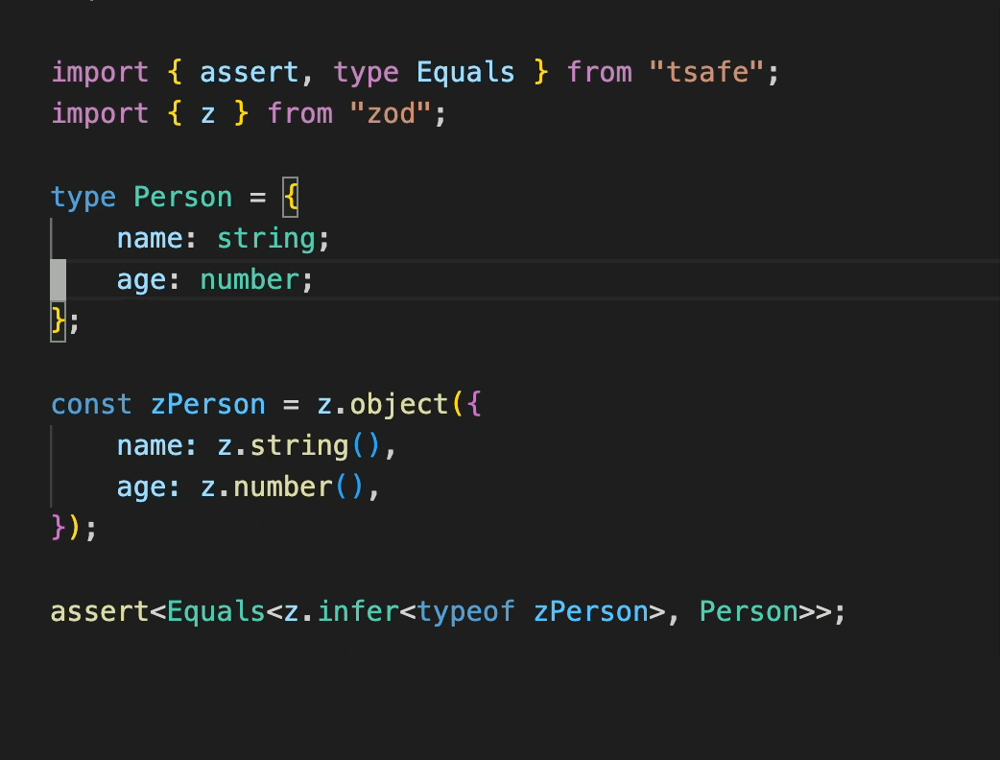

# Equals

### Type level  testing

<figure><figcaption></figcaption></figure>

[Playground](https://stackblitz.com/edit/typescript-rfpzav?file=index.ts\&view=editor)

A less trivial example: [The code](https://github.com/codegouvfr/react-dsfr/blob/main/src/lib/spacing.ts) and it's [corresponding test file](https://github.com/codegouvfr/react-dsfr/blob/main/test/types/spacing.ts).


If you are writing tests for your type, you definitely want to checkout [`//@ts-expect-error`](https://www.typescriptlang.org/docs/handbook/release-notes/typescript-3-9.html#-ts-expect-error-comments)


### Making sure that a zod schema validates a given type

<figure><figcaption></figcaption></figure>

[Playground](https://stackblitz.com/edit/typescript-eheop6?file=index.ts\&view=editor)

```typescript

import { z } from "zod";
import { assert, id, type Equals } from "tsafe";

const z... = (()=>{

   type TagetType = ...;
   
   const zTargetType = z....;
   
   type InferredType = z.infer<typeof zTargetType>;
   
   assert<Equals<TargetType, InferredType>>;
   
   return id<z.ZodType<TargetType>>(zTargetType);   

})();
```

### Making sure all cases of a switch are dealt with

<figure><figcaption></figcaption></figure>

[Playground](https://stackblitz.com/edit/typescript-ryj2ba?file=index.ts\&view=editor)

