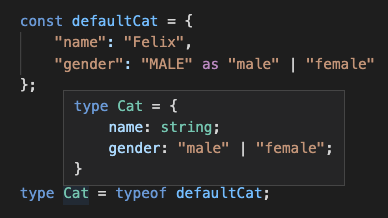

# id

### Used as conveignence for getting type inference

```typescript
 
  type Circle = {
      type: "CIRCLE";
      radius: number;
  };
 
  type Square = {
      type: "SQUARE";
      side: number;
  };
  type Shape= Circle | Square;
 
  declare function f(shape: Shape): void;
 
  f(id<Circle>({ "type": "CIRCLE", "radius": 33 }); <== We have auto completion to instantiate circle.
 

```




