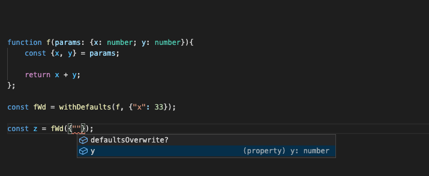

# withDefaults

If you have a function with a set of parameters wrapped in an object, and you wish to call this function multiple times with the same value for one or more of the parameters, withDefaults enables you to instantly generate a new function with these parameters all ready set so that you do not have to fill them in at every call.

### In practice:

Consider a function that takes two numbers as parameters and returns the sum of them.

```typescript
function f(params: {x: number; y: number}){
    const {x, y} = params;
    return x + y;
};
```

Suppose we want to set the value of **x** for example.

```typescript
const fWd = withDefaults(f, {"x": 33});
```

**fWd** is a copy of our original function with **x** set to 33. **withDefaults** first argument is the original function, and the second is an object with the parameters of the original function as properties. Naturally, the properties are inferred by typescript as shown below.


Now we can call **fWd** as many times as we want without having to set **x**. Its value will always be 33.

```typescript
const z = fWd({"z": 10});
```

The value of **z** will be 43. Typescript infers the remaining value to be set:



### Overwriting the injected value:

```typescript
const a = fWd({
  "y": 10, 
  "defaultsOverwrite": {"x": [23]}
});
```

The type of **x** in **defaultsOverwrite** is **"\[number\] \| undefined"** so that **undefined** cannot be assigned to **x** if that is not its type. 

In this case if we assign **undefined** to **x**, the return value of **fWd** will remain unchanged.

